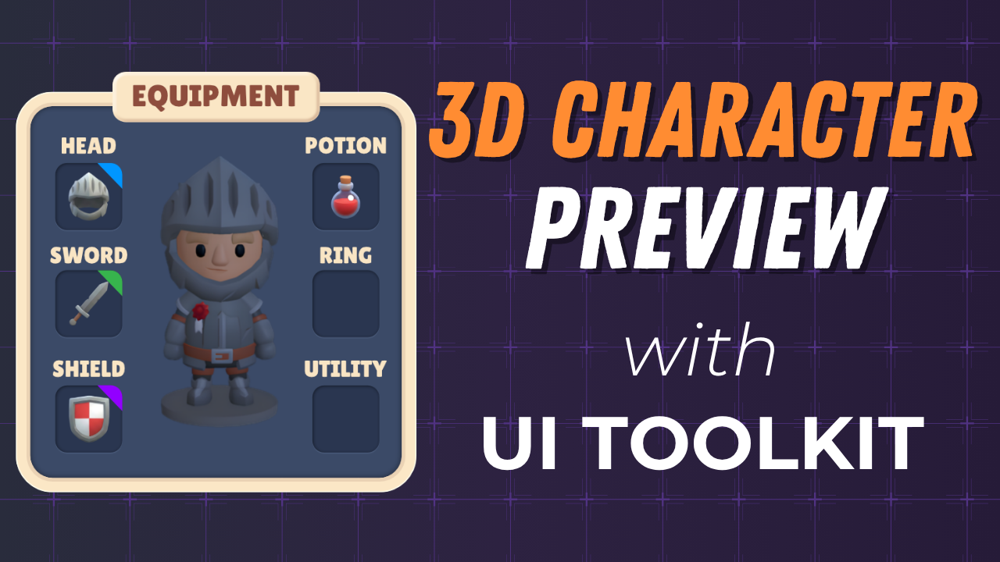

# Part 5: Render a 3D Character Preview

In this tutorial you'll render a live 3D character inside the equipment window using a dedicated layer, a `PreviewCamera`, and a `RenderTexture` for the UI preview. Then you'll write a `PreviewRotateManipulator` so the player can hold right-click and drag to spin the character.

## Course

This tutorial is part of the **[Build Inventory & Equipment Systems with Unity UI Toolkit](https://www.youtube.com/playlist?list=PLUQd-0PkiOI5_msWheOHo-XnyEvQPLpbR)** course. The full course walks through building a complete inventory and equipment system in Unity 6 using UI Toolkit. You'll start from scratch with a reusable window system, design the full UI layout in UI Builder, wire up drag-and-drop item management, render a 3D character preview, and connect everything to player data. No prior UI Toolkit experience needed.

Check out the other parts:

| Part | Topic | Repository |
| ---- | ----- | ---------- |
| 1 | Reusable Window System | [ui-toolkit-pt1-reusable-window-system](https://github.com/gamedev-resources/ui-toolkit-pt1-reusable-window-system) |
| 2 | Design the Inventory UI | [ui-toolkit-pt2-inventory-design](https://github.com/gamedev-resources/ui-toolkit-pt2-inventory-design) |
| 3 | Create the Inventory Data Model | [ui-toolkit-pt3-inventory-data-model](https://github.com/gamedev-resources/ui-toolkit-pt3-inventory-data-model) |
| 4 | Inventory Interactions | [ui-toolkit-pt4-inventory-interactions](https://github.com/gamedev-resources/ui-toolkit-pt4-inventory-interactions) |
| **5** | **Render a 3D Character Preview** | *You are here* |
| 6 | Equipping, Slot Validation & Mesh Swap | Coming Soon |

## What's Included

- [`starter-project/`](starter-project/)
- [`final-project/`](final-project/)

## Starter Project

## Resources

- [Full Playlist](https://www.youtube.com/playlist?list=PLUQd-0PkiOI5_msWheOHo-XnyEvQPLpbR)
- [Unity RenderTexture docs](https://docs.unity3d.com/Manual/class-RenderTexture.html)
- [PointerManipulator](https://docs.unity3d.com/ScriptReference/UIElements.PointerManipulator.html)
- [Layer culling masks](https://docs.unity3d.com/Manual/layer-based-collision-detection.html)

## Credits

- Character art: [KayKit Adventurers](https://kaylousberg.itch.io/kaykit-adventurers) by Kay Lousberg
